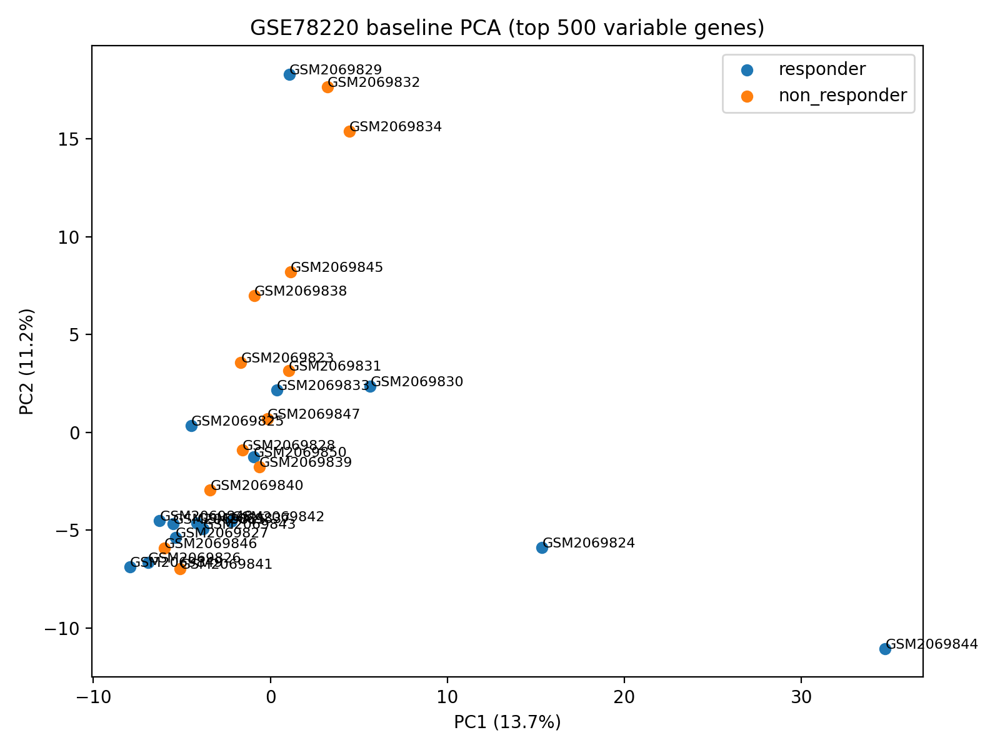
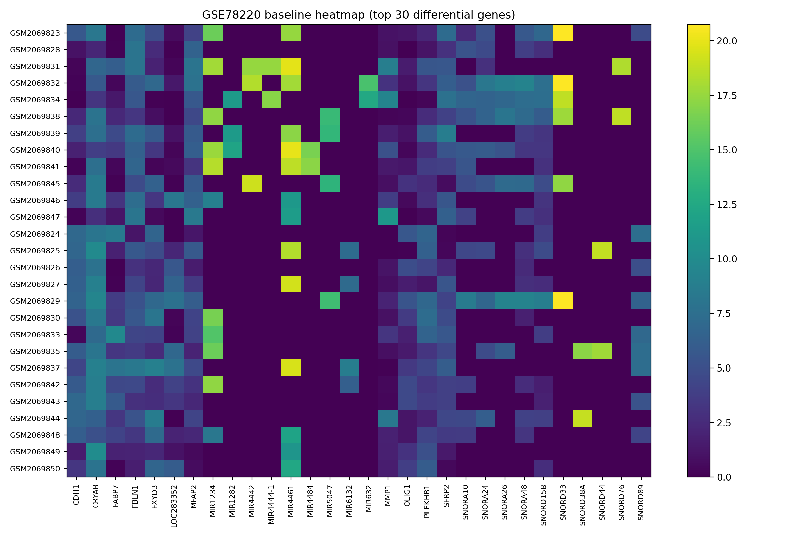
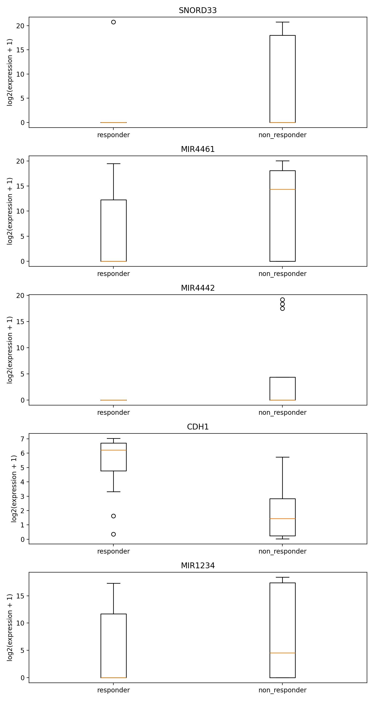
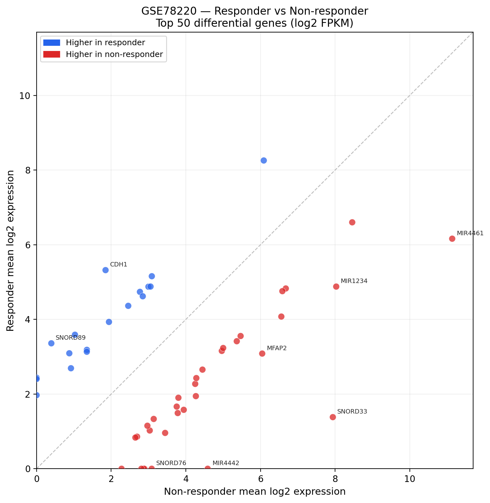

# RNA Responder Pipeline

End-to-end transcriptomics data pipeline for exploring gene expression differences between immunotherapy responders and non-responders, using public GEO RNA-seq data.

---

## What this is

This project is a data engineering pipeline — not a statistical analysis tool. The goal is to build a reproducible, layered system that takes raw public omics data and produces analysis-ready datasets through structured ingestion, metadata parsing, transformation, and modeling.

The biological question provides the domain context: why do some patients respond to immunotherapy while others don't? The engineering question is: how do you reliably extract, validate, and model the data needed to even begin answering that?

```
GEO public repository (GSE78220)
  → GEOparse metadata download
  → registry-driven metadata parsing (datasets.yml)
  → supplementary expression file ingestion
  → join key construction + validation
  → long-format baseline cohort (parquet)
  → DuckDB + dbt (staging → intermediate → marts)
  → analysis scripts (PCA, heatmap, boxplot)
```

---

## Why it's designed this way

**Registry-driven parsing over hardcoded logic.**
GEO datasets don't follow a consistent schema. Response labels appear as "R"/"NR" in one study and "Complete Response"/"Progressive Disease" in another. `config/datasets.yml` holds the per-dataset field names and value mappings, keeping parsing rules separate from code. Adding a new dataset means adding a config block, not changing the parser.

**Explicit mapping only, no substring matching.**
Early iterations used substring matching ("if 'R' in value → responder"). This produced false positives on field values containing unrelated strings. The current parser uses exact key-value mapping from the registry with no partial matches.

**Join key validation before merge.**
The supplementary expression file uses patient-label + timepoint tokens as column names (`Pt1.baseline`, `Pt16.OnTx`). These don't directly correspond to GEO sample IDs. A `validate_join_keys()` step checks that every metadata-derived key exists in the expression file before the merge runs — unmatched keys raise an error, and samples without a resolvable timepoint are logged as warnings and excluded rather than silently dropped.

**DuckDB-first, Athena-ready.**
dbt models run against a local DuckDB file. The layered modeling structure (staging → intermediate → marts) is identical to what would run on Athena. This choice avoids IAM/Glue/workgroup setup during development while keeping the transform layer portable.

**Parser reuse across datasets.**
GSE91061 was added as a second dataset without modifying any parser code. The only change was adding a new entry to `config/datasets.yml` with the dataset-specific field names, response value mapping, and baseline label. The same `parse_metadata()` function processed both datasets. This is the concrete demonstration of the registry-driven design — the parser is genuinely reusable.

---

## Dataset

### GSE78220 — primary dataset

Melanoma patient cohort treated with anti-PD-1 immunotherapy.

| Metric | Value |
|---|---|
| Total samples (metadata) | 28 |
| Baseline cohort samples | 27 |
| Genes in expression matrix | 25,268 |
| Baseline expression rows | 682,236 |

Response mapping: `Complete Response` / `Partial Response` → `responder`, `Progressive Disease` → `non_responder`

Full QC: `outputs/tables/gse78220_qc_summary.csv`

---

### GSE91061 — second dataset

Melanoma patient cohort treated with anti-PD-1 immunotherapy (BMS dataset, 109 samples across pre/on-treatment timepoints).

| Metric | Value |
|---|---|
| Total samples (metadata) | 109 |
| Baseline cohort samples | 23 |
| Genes in expression matrix | 22,187 |

Response mapping: `PD` (Progressive Disease) → `non_responder`. `SD` and `UNK` are excluded as ambiguous.

Note: This dataset was added by extending `config/datasets.yml` only — no changes to parser code were required.

Full QC: `outputs/tables/gse91061_qc_summary.csv`

---

## Tech stack

| Layer | Tools |
|---|---|
| Metadata + Expression | GEOparse, pandas, pyarrow |
| Orchestration | Prefect 3.x |
| Storage format | Parquet (processed), DuckDB (curated) |
| Transform | dbt-core, dbt-duckdb |
| Analysis | scikit-learn, matplotlib |
| Config | PyYAML, python-dotenv |
| Language | Python 3.11 |

---

## Project structure

```
config/
  datasets.yml              # per-dataset parsing registry

pipeline/
  tasks/
    parse_metadata.py       # registry-driven metadata parser
    gse78220.py             # GSE78220-specific ingestion, join, QC
  flows/
    ingest_geo.py           # Prefect flow wrapping the pipeline
  utils/
    config_loader.py        # datasets.yml loader

scripts/
  build_gse78220_baseline_dataset.py   # standalone entrypoint

dbt/
  dbt_project.yml
  profiles.yml.example
  models/
    staging/
      stg_gse78220_expression.sql     # type casting, null filtering
    intermediate/
      int_baseline_log_expression.sql  # log2 transform, baseline filter
      int_gene_group_stats.sql         # per-gene group statistics
    marts/
      mart_top_differential_genes.sql  # responder vs non_responder delta
    schema.yml                         # dbt model tests

analysis/
  utils.py                  # DuckDB connection, shared loaders
  scripts/
    pca.py                  # PCA on top 500 variable genes
    heatmap.py              # heatmap of top 30 differential genes
    boxplot.py              # boxplots of top 5 candidate genes
  notebooks/
    gse78220_eda.ipynb      # exploratory analysis

outputs/
  tables/
    gse78220_qc_summary.csv           # pipeline QC metrics (committed)

docs/
  metadata_notes.md         # raw inspection record, parsing decisions
```

---

## How to run

### 1. Set up environment

```bash
python -m venv .venv && source .venv/bin/activate
pip install -r requirements.txt
cp .env.example .env
```

**Expansion path:** The local DuckDB setup mirrors the structure used on Athena. When ready, processed parquets can be uploaded to S3 and the dbt models can run against Athena external tables without model-level changes.


### 2. Download the expression file

The supplementary expression file is not included in the repo. Download `GSE78220_PatientFPKM.xlsx` from the [GSE78220 GEO series page](https://www.ncbi.nlm.nih.gov/geo/query/acc.cgi?acc=GSE78220) and place it at:

```
data/raw/geo/GSE78220_PatientFPKM.xlsx
```

### 3. Run the ingestion pipeline

**Via Prefect flow (recommended):**

```bash
python pipeline/flows/ingest_geo.py
```

**Via standalone script:**

```bash
python scripts/build_gse78220_baseline_dataset.py
```

Both produce the same outputs in `data/processed/gse78220/`:
- `parsed_metadata.parquet`
- `expression_long.parquet`
- `baseline_long.parquet`

And `outputs/tables/gse78220_qc_summary.csv`.

### 4. Run dbt models

```bash
cp dbt/profiles.yml.example ~/.dbt/profiles.yml

cd dbt
dbt run
dbt test
```

This builds the DuckDB file at `data/curated/rna_responder.duckdb` with all four models.

### 5. Run analysis scripts

```bash
# Run from project root
python analysis/scripts/pca.py
python analysis/scripts/heatmap.py
python analysis/scripts/boxplot.py
```

Figures saved to `outputs/figures/`, supporting tables to `outputs/tables/`.

---

## dbt model overview

| Model | Layer | Materialization | What it does |
|---|---|---|---|
| `stg_gse78220_expression` | staging | view | Reads parquet, casts types, removes nulls |
| `int_baseline_log_expression` | intermediate | view | log2(expression + 1) transform, baseline + labeled samples only |
| `int_gene_group_stats` | intermediate | view | Per-gene mean and stddev by response group |
| `mart_top_differential_genes` | marts | table | Genes ranked by absolute mean difference between groups |

Analysis scripts read from `int_baseline_log_expression` (sample-level data) and `mart_top_differential_genes` (gene rankings) via DuckDB. No script reads parquet files directly.

---

## Analysis outputs

### PCA


### Heatmap


### Boxplot


### PCA — `outputs/figures/gse78220_pca_top500_variable_genes.png`

Baseline samples projected onto PC1/PC2 after variance-based gene filtering (top 500 genes by variance) and StandardScaler normalization. Explained variance ratio is shown on each axis. Each point is labeled with its sample ID.

### Heatmap — `outputs/figures/gse78220_top30_heatmap.png`

Log2 expression values for the top 30 genes by absolute mean difference, with samples sorted by response label.

### Boxplot — `outputs/figures/gse78220_candidate_gene_boxplots.png`

Expression distribution by response group for the top 5 candidate genes from `mart_top_differential_genes`.

Supporting tables for all three are saved to `outputs/tables/`.

### Group comparison scatter — `outputs/figures/gse78220_group_scatter.png`

Mean log2 expression per gene plotted for responders (y-axis) vs non-responders (x-axis). Genes above the diagonal are higher in responders; genes below are higher in non-responders. Top 8 genes by absolute mean difference are labeled. Supporting table: `outputs/tables/gse78220_group_comparison.csv`.



---

## What this project is not

This is exploratory comparison, not formal differential expression analysis. It does not:

- Apply multiple testing correction (e.g., Benjamini-Hochberg)
- Use a statistical model for differential expression (DESeq2, edgeR, limma)
- Control for batch effects or other covariates
- Make causal or clinical claims about biomarkers

The cohort is 27 baseline samples. The analysis is intended to demonstrate data pipeline design, not to produce publication-ready results.

---

## Architecture

See [`docs/architecture.md`](docs/architecture.md) for the full system diagram and design decision log.

Data flow overview:
```
GEO (GSE78220, GSE91061)
→ GEOparse metadata download + supplementary file ingestion
→ registry-driven parsing (config/datasets.yml)
→ join key construction + validation
→ baseline_long.parquet per dataset
→ DuckDB + dbt (staging union → intermediate → marts)
→ PCA / heatmap / boxplot (GSE78220 baseline cohort)
```
**Expansion path:** The local DuckDB structure mirrors a warehouse-style layered model (staging → intermediate → marts). Processed parquets can be uploaded to S3 and the same dbt models run against Athena external tables without model-level changes.

To run with S3 upload enabled:

```bash
export S3_BUCKET_NAME=your-bucket-name
python pipeline/flows/ingest_geo.py --upload-s3
```

This uploads `baseline_long.parquet`, `parsed_metadata.parquet`, and `expression_long.parquet` to:
```
s3://<bucket>/
processed/
gse78220/
baseline_long.parquet
parsed_metadata.parquet
expression_long.parquet
```
---
## Limitations and next steps

The expression data source is FPKM values from supplementary files. GEO datasets don't provide this in a consistent format — GSE78220 uses a patient/timepoint-keyed Excel file while GSE91061 uses sample-title-keyed CSV columns. This is why the parser is registry-driven: each dataset's join key construction is handled separately while sharing the same metadata parsing logic.

GSE91061 has no responder-labeled samples (only `PD` maps to a usable label). The baseline cohort therefore contains only non-responders from this dataset. A more complete multi-study comparison would require a dataset that includes both response groups.

Potential next steps:

- Upload processed parquets to S3 and run dbt models against Athena external tables to validate the "Athena-ready" design claim in practice
- Add gene set enrichment analysis (GSEA) on the top differential genes from the mart layer
- Add a third dataset with both responder and non-responder labels to enable proper multi-study comparison