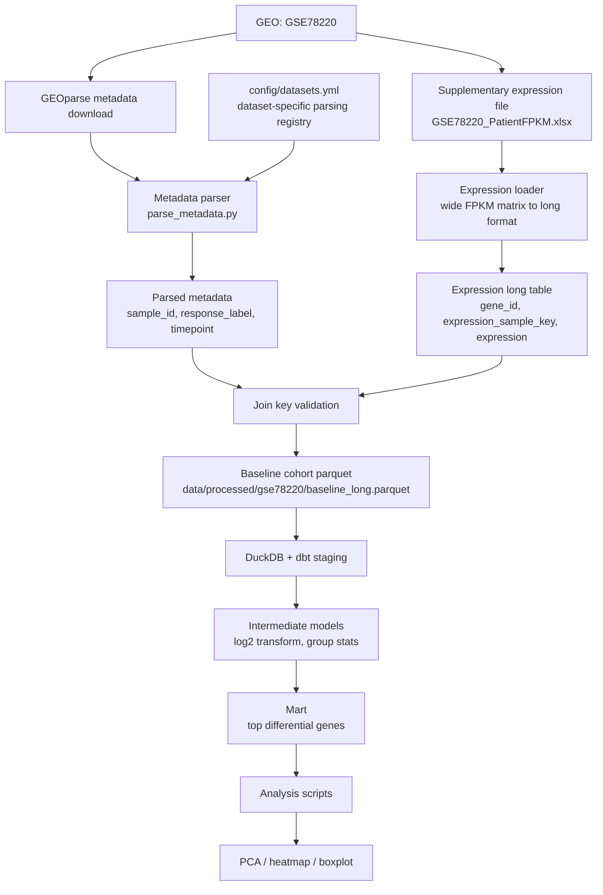

# Architecture

This project is designed as a local-first RNA-seq data pipeline that can later be extended to S3/Athena without changing the core modeling structure.

## Current MVP flow



## Key design decisions

### Registry-driven metadata parsing

GEO metadata is not standardized across studies. Response labels, timepoint fields, and sample identifiers may appear under different columns or use different raw values.

This project keeps dataset-specific parsing rules in `config/datasets.yml` instead of hardcoding them in Python. That makes the parser easier to extend when adding another dataset.

### Explicit response mapping

The parser uses exact value mapping from the dataset registry. It avoids substring matching because short labels such as `R` and `NR` can create false positives when matched loosely.

### Join key validation before merge

The expression matrix uses patient/timepoint-style column names such as `Pt1.baseline` and `Pt16.OnTx`, while GEO metadata uses sample identifiers. The pipeline builds an `expression_sample_key` and validates it before merging.

Unmatched join keys raise an error. Samples without a resolvable timepoint are excluded with a warning instead of being silently dropped.

### DuckDB-first, Athena-ready

DuckDB is used for local development because it avoids S3, Glue, IAM, and Athena workgroup setup during the MVP stage. The dbt layering still follows a warehouse-style structure:

```text
staging -> intermediate -> marts
```

This keeps the project portable to Athena later.