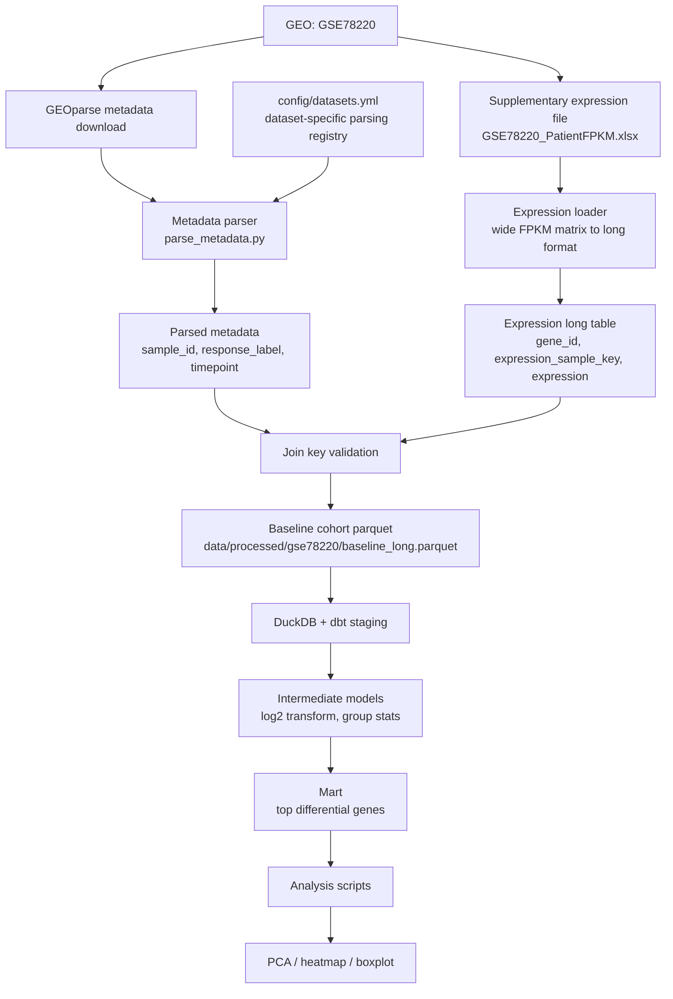

# Architecture

This project is designed as a local-first RNA-seq data pipeline that can later be extended to S3/Athena without changing the core modeling structure.

## Current MVP flow


```mermaid
flowchart TD
    A[GEO: GSE78220] --> B[GEOparse metadata download]
    A --> C[Supplementary expression file<br/>GSE78220_PatientFPKM.xlsx]

    B --> D[Metadata parser<br/>parse_metadata.py]
    C --> E[Expression loader<br/>wide FPKM matrix to long format]

    F[config/datasets.yml<br/>dataset-specific parsing registry] --> D

    D --> G[Parsed metadata<br/>sample_id, response_label, timepoint]
    E --> H[Expression long table<br/>gene_id, expression_sample_key, expression]

    G --> I[Join key validation]
    H --> I

    I --> J[Baseline cohort parquet<br/>data/processed/gse78220/baseline_long.parquet]

    J --> K[DuckDB + dbt staging]
    K --> L[Intermediate models<br/>log2 transform, group stats]
    L --> M[Mart<br/>top differential genes]

    M --> N[Analysis scripts]
    N --> O[PCA / heatmap / boxplot]
```

## Key design decisions

### Registry-driven metadata parsing

GEO metadata is not standardized across studies. Response labels, timepoint fields, and sample identifiers may appear under different columns or use different raw values.

This project keeps dataset-specific parsing rules in `config/datasets.yml` instead of hardcoding them in Python. That makes the parser easier to extend when adding another dataset.

### Explicit response mapping

The parser uses exact value mapping from the dataset registry. It avoids substring matching because short labels such as `R` and `NR` can create false positives when matched loosely.

### Join key validation before merge

The expression matrix uses patient/timepoint-style column names such as `Pt1.baseline` and `Pt16.OnTx`, while GEO metadata uses sample identifiers. The pipeline builds an `expression_sample_key` and validates it before merging.

Unmatched join keys raise an error. Samples without a resolvable timepoint are excluded with a warning instead of being silently dropped.

### DuckDB-first, Athena-ready

DuckDB is used for local development because it avoids S3, Glue, IAM, and Athena workgroup setup during the MVP stage. The dbt layering still follows a warehouse-style structure:

```text
staging -> intermediate -> marts
```

This keeps the project portable to Athena later.
### Group statistics are computed per dataset (no cross-study comparison)

The staging layer unions baseline cohorts from every configured dataset into a
single table. That is deliberate for storage and for the per-dataset comparison
mart — but it creates a trap for group statistics.

`int_gene_group_stats` therefore groups by `dataset_accession` in addition to
`gene_id` and `response_label`, and `mart_top_differential_genes` joins the
responder and non_responder means on `(gene_id, dataset_accession)`. Every row
in the differential-genes mart compares two response groups **from the same
study**.

Reasoning:

- The two current datasets do not have symmetric labels. GSE78220 has both
  responder and non_responder; GSE91061 (PD only) has non_responder only. If
  the group means were pooled across studies, `non_responder_mean` would mix
  the two studies while `responder_mean` came from one, so the difference would
  confound response with study.
- FPKM values are not normalized across studies (different pipelines, different
  gene_id namespaces — HGNC symbols vs hg19KnownGene). Pooling them is not a
  valid comparison even before considering batch effects.

With the current data this means only GSE78220 produces rows in the
differential-genes mart. That is the honest result: it is the only dataset with
both groups. The previous version hid this — the union suggested a multi-study
comparison, but the inner join silently dropped the second study (or, for any
overlapping gene_id, quietly pooled incomparable FPKM values). Making the scope
per-dataset turns a silent behavior into an explicit, testable one.

Proper cross-study differential expression would require gene_id harmonization
and a normalization/batch-correction step (e.g. limma/ComBat). That is out of
scope for this project and not claimed anywhere.
